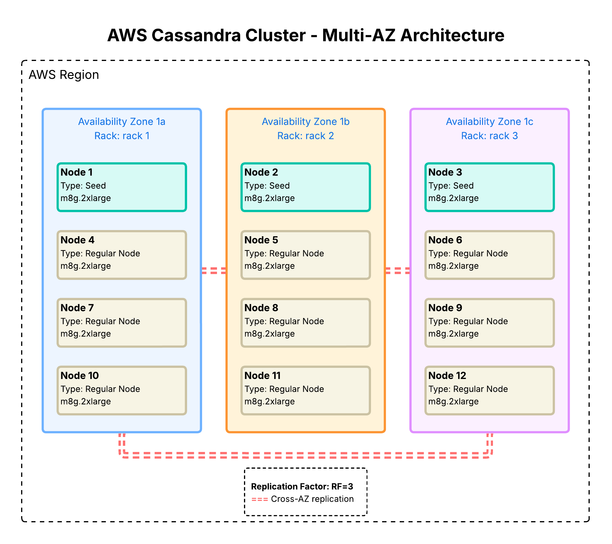

Architected and deployed production Apache Cassandra cluster from scratch on AWS, scaling from 8 to 12 nodes across 3 Availability Zones after six moths in production. The cluster processes 1.46B+ writes (47M/day sustained) from 1M+ connected IoT/mobile devices with exceptional performance: 13μs P50 write latency and 380μs P50 read latency.

Designed multi-AZ topology using rack-aware NetworkTopologyStrategy with RF=3, ensuring single-AZ failure tolerance while achieving 99.99% availability. Selected m8g.2xlarge EC2 instances (AWS Graviton4 Processor) with NVMe SSDs optimized for high-throughput IoT ingestion (20K+ IOPS per node), delivering 30% better price-performance versus x86 alternatives.

Engineered time-series data models using composite partition keys to support 1M+ concurrent devices, evenly distribute write load, and prevent hotspotting. Optimized for time-range queries through timestamp-based clustering (DESC) and TimeWindowCompactionStrategy (TWCS) to align SSTable compaction with temporal access patterns. Implemented TTL-based data lifecycle management and LZ4 compression to balance storage efficiency, compaction overhead, and read performance.

**Key Technical Decisions:**
- Chose Cassandra for predictable latency at scale and cost control
- Migrate all MongoDB production pipelines to an Apache Cassandra cluster

Implemented comprehensive operational infrastructure including hourly incremental backups to S3 using sync to minimize transfer costs by updating only modified SSTables, orchestrated via Apache Airflow DAGs for reliable scheduling and retry logic. Deployed Site24x7 monitoring for real-time cluster health tracking, with custom dashboards for latency metrics, node availability, and disk utilization across all availability zones.

**Impact:** 
- **Reduce the cost of operation by 75%**, from US$6,000 to US$1,500. 
- **99.99% uptime with zero data loss** over 12 months of operation
- Automated disaster recovery with **hourly backups enabling point-in-time restoration**
- Enabled **real-time reports** for product team, reducing time-to-insight from minutes to seconds